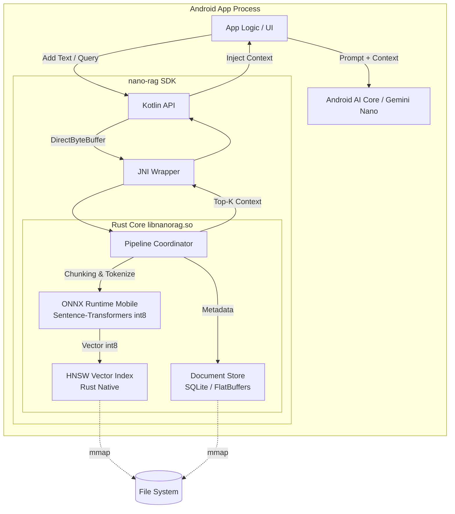

# nano-rag — System Architecture

This document defines the architecture, data flow, memory management, and performance targets of the tiny low-power RAG SDK "nano-rag".

## 1. System diagram

The end-to-end flow: an Android app calls the Kotlin API, JNI hands off to the Rust core for inference and search, and finally context is fed into Gemini Nano.

## 2. Rust ↔ JNI ↔ Kotlin data flow

To strip serialization overhead, the boundary is zero-copy by design.

1. **Insert (Kotlin → Rust)**:
   - Kotlin UTF-8 encodes the text and places it in `ByteBuffer.allocateDirect()` (off-heap).
   - JNI passes the pointer and length to Rust, which references the bytes directly via `std::slice::from_raw_parts` (zero copy).
2. **Inference & search (inside Rust)**:
   - Chunk the text, vectorize with ONNX Runtime to int8.
   - Insert the vector into the HNSW index.
3. **Query (Rust → Kotlin)**:
   - Pull search results (document IDs and distance scores) from a pre-allocated `Arena` allocator on the Rust side.
   - Write directly into Kotlin `LongArray` / `FloatArray` over JNI (using `GetPrimitiveArrayCritical` to minimize GC pauses).

## 3. Memory management strategy

How we hit a peak RAM budget under 50 MB on hostile mobile devices.

- **mmap for lazy load**: HNSW graph and vectors and the document store are all `mmap`ed into the virtual address space. We rely on the OS page cache and never touch the Dalvik / ART heap.
- **Arena allocator**: For per-query work in Rust, a thread-local Bump Arena replaces `malloc` / `free`. The whole arena is freed in one shot at the end of the request, eliminating fragmentation.
- **Zero-copy JNI**: No string / array copying across the JNI boundary. Only `GetPrimitiveArrayCritical` and `DirectByteBuffer` cross the bridge.

## 4. Power-optimization techniques

How we keep battery cost low and avoid thermal throttling.

- **Batched, deferred indexing**: New documents are queued, not processed immediately. We use Android `WorkManager` so ONNX inference batches run only "while charging and idle".
- **Adaptive routing across NNAPI / XNNPACK**: Detect the SoC. On NPU-equipped devices (e.g. Pixel Tensor) we enable the NNAPI delegate; otherwise we fall back to the NEON-tuned XNNPACK.
- **Sleep gating**: During long indexing runs we monitor the SoC's thermal sensors (Thermal API). Above a threshold (e.g. 38 °C) we suspend (`sleep`) to avoid thermal throttling and the resulting power-efficiency cliff.

## 5. Storage layout

The index is persisted in three layered files.

1. **`index.hnsw` (vectors + graph)**:
   - Header + node array (a binary dump of mmap-friendly C structs).
   - Each node stores neighbor IDs and the quantized int8 vector contiguously (e.g. 384 bytes for 384-dim) to maximize cache hits.
2. **`doc.store` (chunk data)**:
   - Document chunks as a binary BLOB compressed with Zstandard (zstd) using a trained dictionary.
3. **`meta.db` (metadata)**:
   - SQLite. Maps document ID → URI (source path or message ID) and creation timestamp.

## 6. Targets (KPIs)

- **Power**: peak < 1 W during indexing / peak < 300 mW during a query
- **Index size**: 10,000 chunks (~2 M characters) in **< 5 MB** (zstd-compressed text + int8 vectors + HNSW graph)
- **Query latency**: top-5 search in **< 50 ms (p95)** (text-to-vector + HNSW search)
- **Peak RAM**: **< 50 MB** (including in-memory ONNX model under 30 MB)
- **Binary size**: AAR **< 15 MB** (arm64-v8a native lib + model file)
