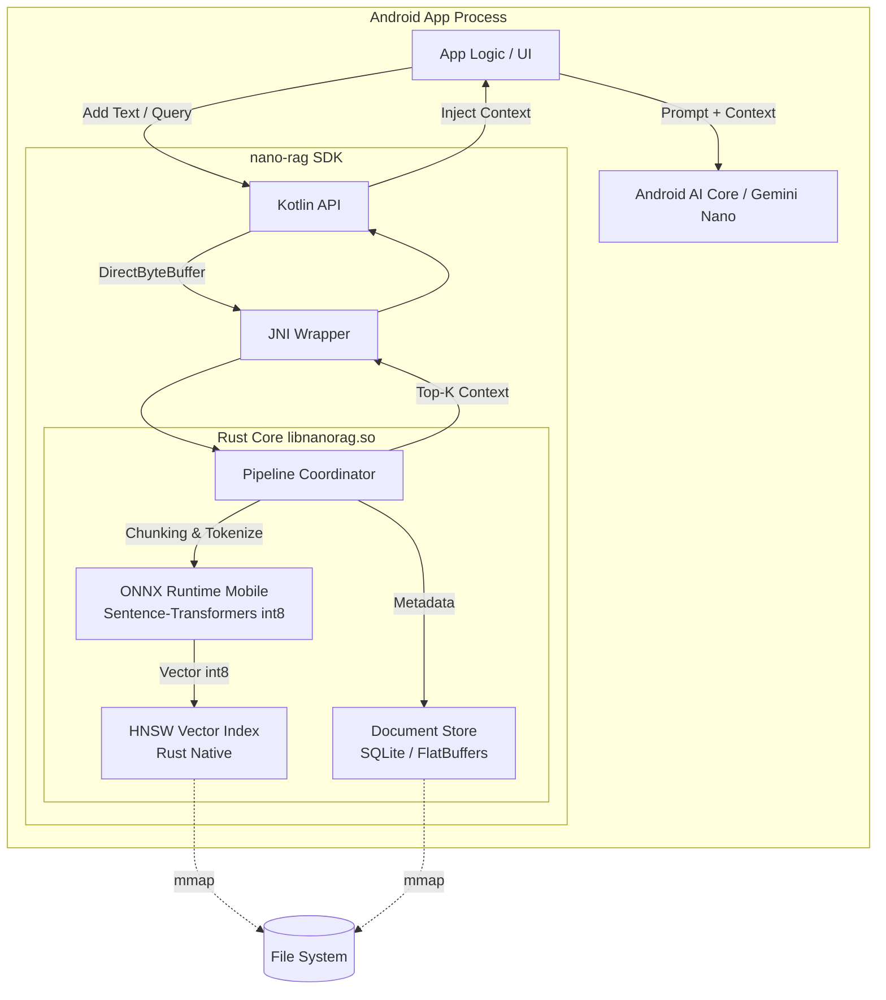

# nano-rag System Architecture

本ドキュメントは、超軽量・低消費電力RAG SDK「nano-rag」のアーキテクチャ設計、データフロー、メモリ管理、および性能目標を定義する。

## 1. システム構成図

AndroidアプリケーションからKotlin JNIを経由し、Rustコアで推論・検索を行い、最終的にGemini Nanoへプロンプトを供給する全体のアーキテクチャを示す。

## 2. Rust ↔ JNI ↔ Kotlin データフロー

シリアライゼーションのオーバーヘッドを極限まで削るため、Zero-Copyアーキテクチャを採用する。

1. **インサート時 (Kotlin → Rust)**:
   - Kotlin側でテキストをUTF-8エンコードし、`ByteBuffer.allocateDirect()` でヒープ外メモリに配置。
   - JNI経由でポインタと長さをRustへ渡す。Rust側は `std::slice::from_raw_parts` でバイト列を直接参照（Zero-Copy）。
2. **推論＆検索 (Rust内部)**:
   - テキストをチャンク化し、ONNX Runtimeでint8ベクトル化。
   - HNSWインデックスにベクトルを登録。
3. **クエリ時 (Rust → Kotlin)**:
   - 検索結果（ドキュメントIDと距離スコアの配列）を、Rust側で事前に確保した `Arena` アロケータから取得。
   - JNIを通じてKotlin側に `LongArray` および `FloatArray` として直接書き込む（Primitive Array Criticalを活用し、ガベージコレクション(GC)の停止を最小化）。

## 3. メモリ管理戦略

モバイル環境の厳しいRAM制限（ピーク50MB以下）をクリアするための戦略。

- **mmapによる遅延読み込み**: HNSWのグラフ構造およびベクトルデータ、ドキュメントストレージはすべて `mmap` を用いて仮想メモリ空間にマッピングする。OSのページキャッシュに依存し、アプリケーションのDalvik/ARTヒープを消費しない。
- **アリーナアロケータ (Arena Allocator)**: Rust内部でのクエリ処理時、動的メモリ確保（`malloc`/`free`）によるフラグメンテーションとオーバーヘッドを防ぐため、スレッドローカルなBump Arenaを使用し、リクエスト単位で一括解放する。
- **Zero-Copy JNI**: JNI境界での文字列・配列のコピーを排除。JNIの `GetPrimitiveArrayCritical` および `DirectByteBuffer` のみをデータ転送のブリッジとして使用する。

## 4. 消費電力最適化テクニック

バッテリ消費を抑え、サーマルスロットリングを回避する。

- **バッチ処理と遅延インデックス構築**: 新規ドキュメントのベクトル化とHNSWグラフ構築は即時実行せず、キューに積む。Androidの `WorkManager` と連携し、「充電中」かつ「デバイスアイドル時」にバッチでONNX推論を実行する。
- **NNAPI / XNNPACK の適応的ルーティング**: 端末のSoCを判定し、NPUが利用可能な端末（Pixel Tensor等）ではNNAPIデリゲートを有効化。非対応端末ではCPUのNEON命令に最適化されたXNNPACKへフォールバックし、推論の消費電力を最小化する。
- **スリープ制御**: 長時間のインデックス構築時、SoCの温度センサー（Thermal API）を監視。設定温度（例: 38℃）を超過した場合は自動的に処理をサスペンド（`sleep`）し、サーマルスロットリングによる電力効率の悪化を防ぐ。

## 5. ストレージレイアウト

インデックスは以下の3層構造でファイルシステムに永続化する。

1. **`index.hnsw` (ベクトル＆グラフ)**:
   - ヘッダ + ノード配列（mmapフレンドリなC構造体のバイナリダンプ）。
   - 各ノードは近傍ノードID配列と、量子化済みint8ベクトル（次元数384なら384バイト）を隣接して配置し、キャッシュヒット率を最大化。
2. **`doc.store` (チャンクデータ)**:
   - Zstandard (zstd) 辞書圧縮を用いたドキュメントチャンクのバイナリBLOB。
3. **`meta.db` (メタデータ)**:
   - SQLite。ドキュメントID、URI（元のファイルパスやメッセージID）、作成日時のマッピングを保持。

## 6. 目標数値 (KPIs)

- **消費電力**: インデックス構築時ピーク < 1W / クエリ時ピーク < 300mW
- **インデックスサイズ**: 10,000チャンク（約200万文字）で **< 5MB**（Zstd圧縮テキスト + int8ベクトル + HNSWグラフ）
- **クエリレイテンシ**: Top-5 検索において **< 50ms (p95)** （テキストからベクトルへの変換 + HNSW検索）
- **RAMピーク使用量**: **< 50MB**（ONNXモデルのインメモリ展開 <30MB を含む）
- **バイナリサイズ**: AARサイズ **< 15MB** (arm64-v8a ネイティブライブラリ + モデルファイル)
